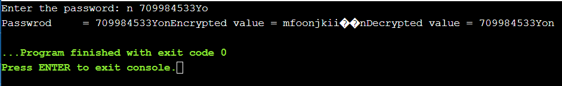

# Encrypt-a-Password
## Encrypt a password using C- programming
* It is as simple as you could think of all you need to do is enter your mix password.
* Use any C-compiler to use or run the code.
# DEMO PREVIEW
* 
